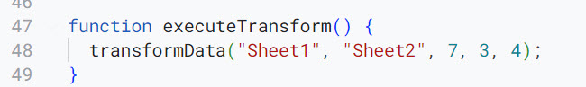

# -appscript-convert-pivot-col-to-row

ข้อมูลตั้งต้น ให้สังเกตว่า 1 บรรทัด จะแสดงข้อมูลแบบ pivot (column) ซึ่งประกอบด้วย 4 ชุด, ชุดละ 3 column

ผลจากการรันจะไปใส่ใน Sheet 2

function สามารถ ปรับตัวแปรได้
1. Sheet1 = input
2. Sheet2 = output
3. 7 = ให้เริ่มตัดตั้งแต่ตำแหน่งตรงไหน (นับ index 0)
4. 3 = 1 set ข้อมูล เช่น type, value, name ประกอบด้วย 3 column
5. 4 = ทั้งหมดนี่ต้องการ 4 set เช่น แยกราย 4 product

